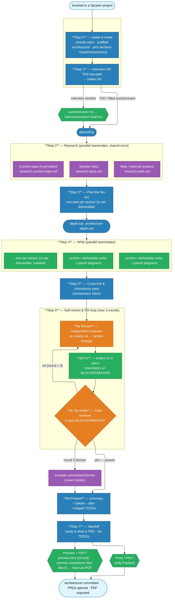

# architecture-prep

Turns a mostly-empty Spryker `architecture/` template folder into a real, project-specific,
decision-grade **arc42 + C4** architecture document — version-controlled Markdown + Mermaid (`.mmd`).
It's an **orchestrator**: it gathers inputs, grounds every claim in real Spryker docs / the running
system, fans the writing out to teammate subagents, then runs a **review → fix → re-verify loop**
until the document passes.

Runs in any Spryker project or demoshop (b2b / b2c / marketplace / suite) from the project root, and
scaffolds the `architecture/` folder if it's missing.

## When it triggers

"prepare/fill in the architecture", "set up the architecture folder", "do the arc42/C4 docs",
"document the system context / building blocks / runtime flows", "capture this as an ADR / solution
design", or "turn this TAD / these TADs into architecture docs (as PRs)" — even without the words
"arc42" or "C4". Not for writing a PRD, building from a PRD, or fixing a bug.

## Three ways in

| Input | What happens |
|---|---|
| **Nothing structured** | Batched interview ([interview.md](references/interview.md)) driven by the [questionnaire.md](references/questionnaire.md) question bank |
| **A filled/partial questionnaire** | Skips the interview (or asks only the blanks) |
| **A Spryker TAD / structured brief** | The doc IS the intake — no interview ([tad-mapping.md](references/tad-mapping.md)) |

One deliverable → one document edited in place. **N TADs/briefs → N documents → N PRs**, one git
worktree per deliverable ([multi-deliverable.md](references/multi-deliverable.md)).

## Workflow

The loop is the point: review **drives fixes**, it doesn't just report. A round that finds a BLOCKER or
MAJOR is always followed by a fix pass and a fresh re-verify — in both Gated and Autonomous mode. Every
finding ends either *fixed* or *converted to a triaged owned gap*; nothing is silently dropped.

## Reference files (read the right one at the right time)

| File | What it covers | Read when |
|---|---|---|
| [run-lean.md](references/run-lean.md) | Run dir, State Object, logging, decision log | Start of every run |
| [questionnaire.md](references/questionnaire.md) | The canonical fillable question bank (groups A–J + R) | Before Step 1 |
| [interview.md](references/interview.md) | How to collect the questionnaire (batches, docs-first) | Before Step 1 |
| [tad-mapping.md](references/tad-mapping.md) | TAD fast-path: TAD-section → arc42-section | Step 0, if a TAD is the input |
| [multi-deliverable.md](references/multi-deliverable.md) | N inputs → N worktrees/branches → N PRs | Step 0, if N > 1 |
| [sections.md](references/sections.md) | Per-arc42-section writer guidance + diagram map | Step 4, each writer its own § |
| [architecture-depth.md](references/architecture-depth.md) | The decision-grade / build-ready depth bar | Orchestrator once + every writer |
| [review.md](references/review.md) | Spryker-specific self-review checklist | Before Step 6 + the reviewer subagent |
| [preview.md](references/preview.md) | Two project-agnostic (copy-only) files in `architecture/`: `preview.html` (dev — served, auto-discovers docs) + `preview-standalone.html` (handoff — pure-Bash-built, opens over file://) + PDF export | Step 7, to view or export the doc |

## The arc42 sections

`01` introduction & goals · `02` constraints · `03` system scope & context (+C1) · `04` solution
designs · `05` building block view (+C2/C3) · `06` runtime view (+sequences) · `07` deployment view ·
`08` crosscutting concepts · `09` architecture decisions (ADRs) · `10` quality requirements (volumes) ·
`11` risks & technical debt · `12` glossary. Step 0 asks which to produce this run; only those are
written.
