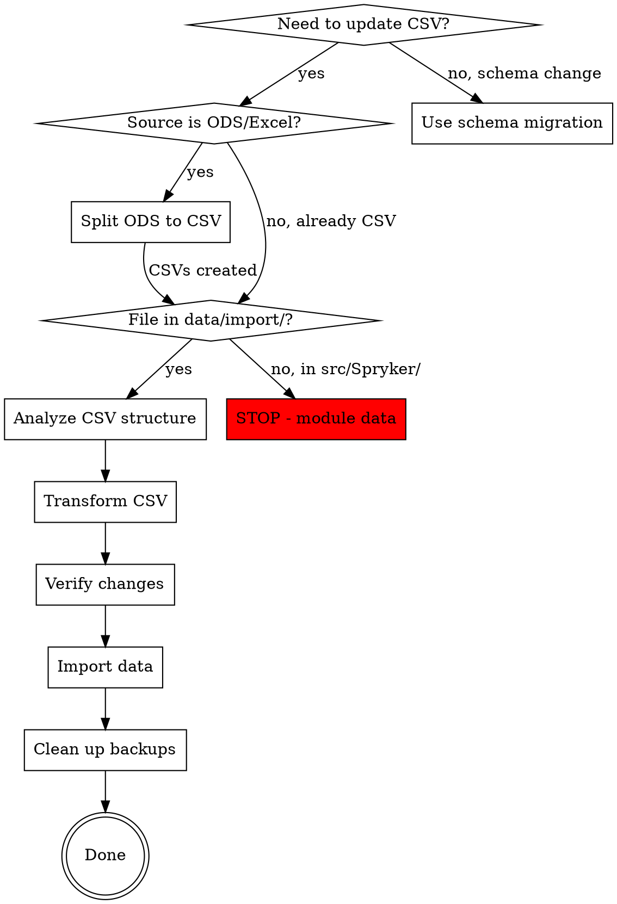

# Spryker Demo Data Updates - Decision Flow

## Visual Workflow

## Decision Points

### Is this a CSV update?
- **YES** → Proceed to next check
- **NO (schema change)** → Use migration files, not CSV tools

### Is source file ODS/Excel format?
- **YES** → Split to CSV first using `splitOdsToCsv`
- **NO (already CSV)** → Proceed directly to file location check

### Is file in data/import/?
- **YES** → Safe to proceed with analysis
- **NO (in src/Spryker/)** → STOP - this is module example data, do not modify

### Do structures match?
- **YES** → Proceed with transformation
- **NO** → ASK user about structure changes before proceeding

### Do row counts suggest data loss?
- **Source >= Target** → Safe to proceed (APPEND or REPLACE as instructed)
- **Source < Target** → ASK user about data deletion before REPLACE mode

### After transformation complete?
- **Always proceed automatically:** Verify → Import → Cleanup
- **Never ask:** "Should I import?" or "Should I cleanup?"
