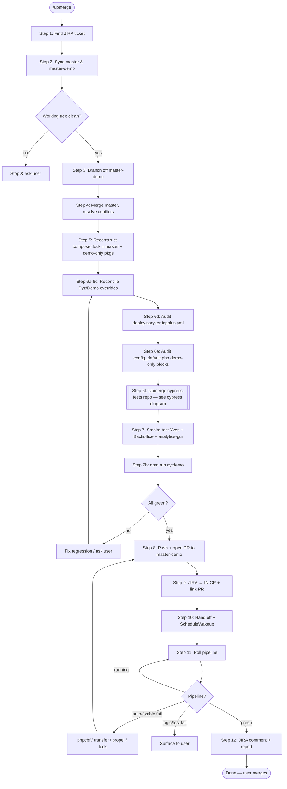
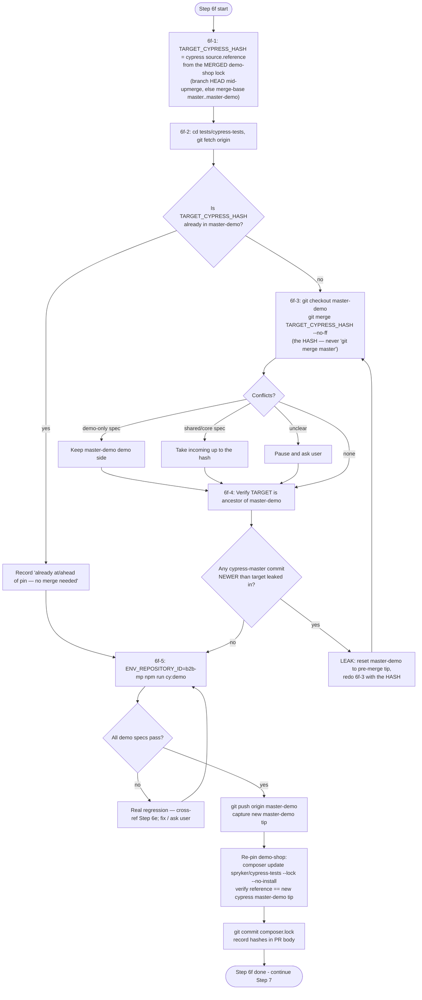

# Upmerge `master` → `master-demo` — Operator Guide

This README explains the recurring **upmerge** workflow for the `b2b-demo-marketplace`
repo in plain steps, with diagrams. The executable, command-by-command version lives in
[`SKILL.md`](./SKILL.md) and runs via `/upmerge`. Read this first to understand *why*
each step exists; use `SKILL.md` for the exact commands.

## What an upmerge is

`master-demo` is the demo branch. It is `master` **plus** demo-only additions (the AI
Commerce features, demo data, branded Twig, demo-only config blocks, and the demo Cypress
specs). Periodically we bring the latest `master` changes *into* `master-demo` so the demo
branch doesn't drift. That direction — **`master` → `master-demo`, never the reverse** — is
the upmerge.

The hard part is everything `git merge` *cannot* see:

- **Shadowed overrides** — a core Twig/class changes upstream while `src/Pyz` (or `src/Demo`)
  shadows it; git sees no overlap, the override silently goes stale.
- **Silently dropped demo-only config** — a reconciled master-side commit deletes a
  demo-only block in `config/Shared/config_default.php` with **zero conflict markers**,
  while the code reading it stays wired → runtime crash (the QuickSight incident).
- **The external Cypress repo** — `spryker/cypress-tests` is a *separate* repo with its own
  `master`/`master-demo`. The demo-shop merge never touches it; it must be upmerged
  explicitly, and **by a specific commit hash, not by cypress master's tip** (see below).

## The 12 steps

| # | Step | Why it exists |
|---|------|---------------|
| 1 | **Find the JIRA ticket** | Drives the branch name + PR title (CC board 2237). |
| 2 | **Sync `master` & `master-demo`** | Fetch + fast-forward refspecs so HEAD stays put; stop on dirty tree. |
| 3 | **Create the feature branch** | `feature/<ticket>/upmerge-latest-master` off `master-demo`. |
| 4 | **Merge `master`, resolve conflicts** | `composer.lock` → regenerate; `config_default.php` → never drop demo-only blocks. |
| 5 | **Refresh `composer.lock`** | Final lock = master's lock **+** demo-only packages only. No bare `composer update`. |
| 6a–6c | **Reconcile Pyz/Demo overrides** | Re-align overrides that shadow changed core files (esp. Twig). Silent divergence. |
| 6d | **Audit `deploy.spryker-icpplus.yml`** | New feature may need a deploy entry/env var the merge never flagged. |
| 6e | **Audit `config_default.php`** | Catch demo-only config blocks dropped with no conflict marker (QuickSight canary). |
| **6f** | **Upmerge the `cypress-tests` repo** | **Merge cypress `master-demo` to the HASH demo-shop master pins — NOT cypress master's tip.** Re-pin the demo-shop. |
| 7 | **Smoke-test Yves + Backoffice** | Login + customer overview + dashboard + `analytics-gui` (QuickSight canary). |
| 7b | **Run `cy:demo`** | Mandatory automated coverage of demo-only features; predicts CI's `Run Tests (Demo)`. |
| 8 | **Push + open PR** | Targets `master-demo`; PR body records every audit (6a–6f). |
| 9 | **Move JIRA to IN CR** | Transition name "Start CR"; verify status actually changed. |
| 10 | **Hand off + schedule poll** | Tell user; `ScheduleWakeup` for the pipeline check. |
| 11 | **Poll pipeline + auto-fix** | phpcs/transfer/propel/lock are auto-fixable; logic/test failures go to the user. |
| 12 | **Final report** | Green pipeline → JIRA comment + tell user. Never auto-merge. |

## General flow



## Step 6f in detail — the cypress-tests upmerge

`spryker/cypress-tests` is its own repo, checked out under `tests/cypress-tests/`. The
demo-shop's `composer.json` pins it as `require-dev: "spryker/cypress-tests": "dev-master-demo"`,
so the demo shop installs the cypress repo's `master-demo` branch.

### Why merge by HASH, not by cypress master's tip — and which hash

The demo-shop pins `spryker/cypress-tests` to a **specific commit reference** in its
`composer.lock` (`source.reference`). Cypress `master` is almost always *far ahead* of that
pinned commit — **64 commits ahead** in the 2026-06-27 case.

**The PIN is the cypress version of the MERGED demo-shop — not master's tip.** The demo-shop
`master-demo` only contains `master` up to the point it was last upmerged. So the cypress
version it must match is the one pinned by the **master commit already merged into
`master-demo`** = `git merge-base master master-demo`. (On the active upmerge branch — after
`master` was merged in — that merged version is simply the branch's own `composer.lock`, read
from `HEAD`.) Reading demo-shop **master's tip** instead would demand a cypress version for
shop code `master-demo` doesn't have yet — the inverse skew.

```
demo-shop repo:                          cypress repo:
  master:  …──○──○──○  ← tip (newer pin)    master:  …──●──●──●──●──●──●  ← TIP (OFF LIMITS)
              │                                          │
  merge-base  ○  ← last master merged                    ●  TARGET_CYPRESS_HASH
  into demo   │     into master-demo;                pin │     = cypress ref the merge-base
              │     READ ITS cypress pin   ───────────╯  │       commit's lock points to
  master-demo ○──◆──◆  (◆ = demo-only)      master-demo: …──●──◇──◇  (◇ = demo-only specs)
                                                          ↑ merge ONLY up to TARGET, no further
```

If you ran `git merge master` in the cypress repo, `master-demo` would absorb all 64 newer
commits and run **ahead of the demo-shop version** — asserting selectors/fixtures/behavior the
shop doesn't have yet → flaky, false failures, version skew. So cypress `master-demo` is
advanced to **exactly the commit the merged demo-shop version pins, and no further.** The
pinned hash is the merge target; cypress master's tip is off-limits.

After merging, you push the cypress `master-demo` branch and **re-pin the demo-shop's
`composer.lock`** to the new cypress `master-demo` tip, so the demo shop installs the
upmerged tests.

### Cypress upmerge flow



### Key commands (full versions in `SKILL.md` Step 6f)

```bash
# 6f-1 — target hash = cypress ref the MERGED demo-shop version pins.
# On the upmerge branch (master already merged in), read the branch lock:
git show HEAD:composer.lock | python3 -c "import json,sys; d=json.load(sys.stdin); p=[x for x in d['packages']+d['packages-dev'] if x['name']=='spryker/cypress-tests'][0]; print(p['source']['reference'])"
# Standalone (validating master-demo directly), read the merge-base lock instead:
MB=$(git merge-base master master-demo)
git show "${MB}:composer.lock" | python3 -c "import json,sys; d=json.load(sys.stdin); p=[x for x in d['packages']+d['packages-dev'] if x['name']=='spryker/cypress-tests'][0]; print(p['source']['reference'])"

# 6f-2/3 — merge the HASH into cypress master-demo (never 'git merge master')
cd tests/cypress-tests && git fetch origin
git merge-base --is-ancestor <TARGET_CYPRESS_HASH> master-demo && echo "already in master-demo" || echo "merge required"
git checkout master-demo
git merge <TARGET_CYPRESS_HASH> --no-ff -m "Upmerge cypress master (@<TARGET_CYPRESS_HASH>) into master-demo for <TICKET>"

# 6f-4 — guard against leaking newer-than-target master commits
git log --oneline <TARGET_CYPRESS_HASH>..origin/master | wc -l   # commits you must NOT have pulled in

# 6f-5 — validate, push, re-pin demo-shop
ENV_REPOSITORY_ID=b2b-mp ENV_IS_SSP_ENABLED=true npm run cy:demo
git push origin master-demo
# back in demo-shop root, on the upmerge branch:
composer update spryker/cypress-tests --lock --no-install --ignore-platform-reqs
git add composer.lock && git commit -m "chore(composer): re-pin spryker/cypress-tests to upmerged master-demo for <TICKET>"
```

## Quality gate: `check-cypress-not-ahead.sh`

A standalone script in this folder enforces the rule above deterministically — it fails
if cypress `master-demo` is **ahead of** (or **behind**) the cypress version pinned by the
**merged demo-shop version**. By default it derives that PIN from the **merge-base of
demo-shop `master` and `master-demo`** (the latest master version already in `master-demo`) — correct
when run against a `master-demo` that already contains the upmerge (CI, or post-merge), **but a false
FAIL when run on the feature branch mid-upmerge** (see the ⚠️ callout below — use `DEMOSHOP_REF=HEAD`).
Use it in Step 6f-4, as a pre-push hook, or as a CI gate.

```bash
# From the demo-shop repo root — auto-detects tests/cypress-tests:
.claude/skills/upmerge-master-to-demo/check-cypress-not-ahead.sh
```

> ### ⚠️ Running it LOCALLY on the upmerge feature branch
>
> The plain command above only derives the right PIN when the upmerge is **already on
> `master-demo`** (i.e. after the PR is merged, or in CI). While you are still on the
> `feature/<ticket>/upmerge-latest-master` branch, `master-demo` is the *pre-upmerge* branch, so
> `merge-base(master, master-demo)` points at the **stale** old pin and the gate reports a
> **false `❌ FAIL` (AHEAD by N commits)** even though the cypress branch is correct. The
> `FIX: … git merge <hash>` line it prints is a **false alarm** in this case — do **not** reset/re-merge.
>
> **Correct local command (run this on the feature branch):**
>
> ```bash
> cd <demo-shop repo root>
> DEMOSHOP_REF=HEAD sh .claude/skills/upmerge-master-to-demo/check-cypress-not-ahead.sh
> ```
>
> `DEMOSHOP_REF=HEAD` reads the PIN from **your branch's** `composer.lock` (the merged + re-pinned
> cypress ref) → correct `✅ PASS`. Use this **after** the Step 6f-5 re-pin commit. **Before** that
> commit, use `TARGET_HASH=<merged cypress pin>` instead (HEAD's committed lock still has the old ref).
> The plain, no-env form becomes correct on its own only once the PR merges into `master-demo` — which
> is why the **CI** run (below) is green with no overrides.

**What it asserts** (TARGET = `spryker/cypress-tests` `source.reference` read from the PIN ref — by default the merge-base `master`..`master-demo`):

| Check | Passes when | Fails when |
|---|---|---|
| 1 — not behind | TARGET is an ancestor of cypress `master-demo` | `master-demo` doesn't contain the pin (merge missing/incomplete) |
| 2 — not ahead | no commit reachable from `master-demo` is newer than TARGET on cypress `master` | a cypress-master commit newer than the pin leaked into `master-demo` |

**Exit codes:** `0` pass · `1` gate failed (lists the offending commits for the ahead case) · `2` setup error.

**Env overrides** (all optional):
- `DEMOSHOP_MASTER` (default `master`) and `DEMOSHOP_DEMO` (default `master-demo`) — the two branches the PIN merge-base is computed from.
- `DEMOSHOP_REF` — read the PIN from this explicit ref instead of the merge-base (e.g. `DEMOSHOP_REF=HEAD` on the upmerge branch to validate the exact lock you're about to ship).
- `TARGET_HASH` — supply the PIN hash directly, skipping composer.lock entirely.
- `CYPRESS_DEMO` (default `master-demo`), `CYPRESS_MASTER` (default `origin/master`), `CYPRESS_DIR`, `DEMOSHOP_DIR`, `NO_FETCH=1` (skip `git fetch`).

**As a CI step** (e.g. GitHub Actions) — run it after checking out both the demo-shop and the
cypress branch so the refs are present:

```yaml
  - name: Cypress demo branch not ahead of demo-shop pin
    run: .claude/skills/upmerge-master-to-demo/check-cypress-not-ahead.sh
```

The gate maps 1:1 to Step 6f-4 — a green local run predicts the CI gate, and a red CI gate
points straight back to Step 6f (re-merge the **hash**, not cypress `master`).

## Golden rules

- **`master` → `master-demo` only.** Never merge `master-demo` back into `master`.
- **In the cypress repo: merge the HASH, never `git merge master`.** The demo cypress branch
  must match what demo-shop master pins, not run ahead of it.
- **A clean `git merge` is not "no work".** Steps 6a–6f catch the silent divergences git
  can't flag.
- **Never auto-merge the PR.** That's always the user's call.
- **When intent is unclear — pause and ask.** A bad force-move or mis-merge costs far more
  than one question.
