# System Scope and Context

Delimits your system from its (external) communication partners. Specifies the external interfaces.

## Business Context

Shows the system's business environment - all communication partners with business/technical reasoning.
Use your c1 level diagram: 

```mermaid
---
config:
  layout: elk
---
flowchart LR
    Customer["👤 Customer"] -- Browse & Purchase --> Spryker["🛒 Spryker B2B Marketplace<br>Platform"]
    BackofficeUser["👤 Backoffice User"] -- Manage Platform --> Spryker
    MerchantUser["👤 Merchant User"] -- Manage Products & Orders --> Spryker
    DevOpsEngineer["👤 DevOps Engineer"] -- Monitor Performance --> APM["📊 Application Performance<br>Monitoring"]
    BusinessAnalyst["👤 Business Analyst"] -- Analyze Data --> BI["📈 Business Intelligence<br>Platform"]
    Customer -- Authentication --> CIAM["🔐 CIAM System<br>Identity & Access"]
    BackofficeUser -- Authentication --> CIAM
    MerchantUser -- Authentication --> CIAM
    Spryker -- New Orders --> ERP["💾 ERP System<br>Orders & Inventory"]
    PIM["📦 PIM System<br>Product Data"] -- Product Data --> Spryker
    Spryker <-- Payments --> Payment["💳 Payment Gateway<br>Transactions"]
    CIAM -- Customer data, tokens --> Spryker
    ERP -- Stock, Order Updates --> Spryker
    Spryker -- Metrics & Traces --> APM
    Spryker -- Business Data --> BI

    Customer:::userStyle
    Spryker:::systemStyle
    BackofficeUser:::userStyle
    MerchantUser:::userStyle
    DevOpsEngineer:::userStyle
    APM:::externalStyle
    BusinessAnalyst:::userStyle
    BI:::externalStyle
    CIAM:::externalStyle
    ERP:::externalStyle
    PIM:::externalStyle
    Payment:::externalStyle
    classDef userStyle fill:#e1f5ff,stroke:#0366d6,stroke-width:2px
    classDef systemStyle fill:#fff4e6,stroke:#ff9800,stroke-width:3px
    classDef externalStyle fill:#f5f5f5,stroke:#666,stroke-width:2px
```

## Technical Context

Provide important details about external systems and interfaces that don't fit on the diagram above.

### External Systems

Describe external systems, their responsibilities, and key stakeholders:

| System | Description | Technology | Stakeholders |
|--------|-------------|------------|--------------|
| CIAM System | Identity and access management for all user types | OAuth 2.0 / SAML | *List contact person/team* |
| ERP System (SAP ECC 6.0) | Master system for orders and inventory | REST API | *List contact person/team* |
| PIM System (Akeneo) | Product data management and base prices | CSV export via S3 | *List contact person/team* |
| Payment Gateway | Payment processing | REST API / Webhooks | *List contact person/team* |

### Integration Details

Describe key integration characteristics (protocol, sync/async, frequency, constraints):

| Integration | Direction | Protocol | Frequency / Constraints |
|-------------|-----------|----------|------------------------|
| PIM → Spryker | Pull | CSV via S3 API | Daily batch import, ~10K products |
| Spryker → ERP | Push | REST API (sync) | Real-time order creation, <100/min limit |
| Spryker ↔ CIAM | Bidirectional | OAuth 2.0 / SAML | Real-time authentication |
| Spryker ↔ Payment | Bidirectional | REST + Webhooks | Real-time transactions |

---

*Corresponds to [arc42 Section 3](https://docs.arc42.org/section-3/)*
