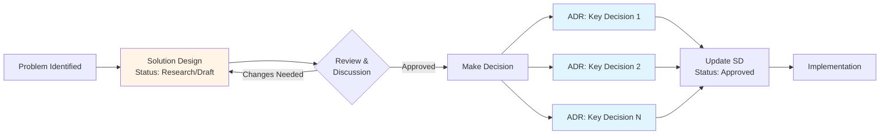

# Solution Designs

This directory contains solution design documents that describe specific changes, integrations, or research for the system.

## What is a Solution Design?

A solution design document (SD) provides a comprehensive technical blueprint for implementing a specific feature, integration, or system change. SDs can also be understood as RFCs (Request for Comments) in other organizations - they serve the same purpose of exploring options and proposing solutions before decisions are made.

Unlike ADRs which capture *decisions*, solution designs capture the *complete design* including:

- Problem statement and requirements
- Proposed architecture with diagrams
- Implementation approach
- Trade-offs and alternatives
- Integration points and dependencies

## When to Create a Solution Design

Create a solution design when:
- Integrating with third-party systems (ERP, PIM, CIAM, Payment Gateway)
- Building a new major feature or capability
- Making significant architectural changes
- Researching and proposing technical approaches
- The work requires detailed planning across multiple components

## Naming Convention

Solution designs follow the pattern: `sd-XXX-brief-title.md`

Examples:
- `sd-001-erp-integration.md`
- `sd-002-payment-gateway-integration.md`
- `sd-003-ciam-authentication.md`

## Template

Use `sd-000-template.md` as the starting point for new solution designs.

## Process Flow: SD to ADR

Solution Designs serve as the exploration and proposal phase, which then results in Architecture Decision Records:

**Key Points:**
- One SD (exploration) can result in **multiple ADRs** (decisions)
- SD status evolves: Research → Draft → Approved → Implemented
- ADRs extract and document the key architectural decisions made during SD review
- The SD is updated to reference the ADRs once decisions are made

**Workflow:**
1. Write SD to explore options and propose solution
2. Review SD with stakeholders
3. Make decisions and extract them into ADRs
4. Update SD status to "Approved" and reference ADRs
5. Implement following the SD blueprint

---

*Corresponds to [arc42 Section 4](https://docs.arc42.org/section-4/)*
