# Building Block View

Static decomposition of the system into building blocks (modules, components, subsystems) and their relationships.

## c4 level 2: Container View

```mermaid
---
config:
   layout: elk
---
flowchart LR
   subgraph Spryker["Spryker B2B Marketplace Platform"]
      Yves["🌐 Yves<br><small>Twig + PHP</small><br><small>Storefront - Customer-facing shop interface</small>"]
      BackOffice["🏢 BackOffice<br><small>Twig + PHP</small><br><small>Admin UI - Platform management interface</small>"]
      MerchantPortal["🏪 Merchant Portal<br><small>Twig + PHP</small><br><small>Merchant UI - Product &amp; order management</small>"]
      StoreFrontAPI["🔌 StoreFront API<br><small>PHP</small><br><small>REST API for storefront operations</small>"]
      BackendAPI["⚙️ Backend API<br><small>PHP</small><br><small>Internal backend business logic</small>"]
      BackendGateway["🚪 Backend Gateway<br><small>PHP</small><br><small>API Gateway routing to backend services</small>"]
      MySQL["🗄️ MySQL/MariaDB<br><small>Relational database for persistent data</small>"]
      Redis["⚡ Redis<br><small>In-memory cache for sessions &amp; KV storage</small>"]
      OpenSearch["🔍 OpenSearch<br><small>Search engine for product catalog</small>"]
      RabbitMQ["📬 RabbitMQ<br><small>Message broker for async processing</small>"]
      Jenkins["⏰ Scheduler<br>Jenkins + PHP<br><small>Job scheduler &amp; processor</small>"]
      FileStorage["📁 File Storage<br><small>AWS S3</small><br><small>Import/Export files</small>"]
   end
   Customer["👤 Customer<br><small>End user browsing and purchasing</small>"] -- Browse &amp; Purchase<br>[HTTPS] --> Yves
BackofficeUser["👤 Backoffice User<br><small>Admin managing platform</small>"] -- Manage Platform<br>[HTTPS] --> BackOffice
MerchantUser["👤 Merchant User<br><small>Merchant managing catalog</small>"] -- Manage Catalog &amp; Orders<br>[HTTPS] --> MerchantPortal
Yves -- Process customer requests<br>[HTTPS] --> BackendGateway
Yves -- Read/Write Session Data<br>Fetch cached Data<br>[TCP] --> Redis
Yves -- Search, Catalog<br>[REST] --> OpenSearch
BackendGateway -- Read/Write Data<br>[SQL] --> MySQL
MerchantPortal -- Read/Write Data<br>[SQL] --> MySQL
StoreFrontAPI -- Process customer requests<br>[HTTPS] --> BackendGateway
StoreFrontAPI -- Read/Write Session Data<br>Fetch cached Data<br>[TCP] --> Redis
StoreFrontAPI -- Search, Catalog</br>[REST] --> OpenSearch
BackOffice -- Read/Write Data<br>[SQL] --> MySQL
BackendAPI -- Read/Write Data<br>[SQL] --> MySQL
Jenkins -- Process scheduled jobs<br> --> Jenkins
Jenkins -- Trigger/Publish Events<br>[AMQP] --> RabbitMQ
Jenkins -- Read/Write Data<br>[SQL] --> MySQL
Jenkins -- Populate Key Value cache<br>[TCP] --> Redis
Jenkins -- Populate Search Index<br>[REST] --> OpenSearch
Jenkins -- Read import files<br>[S3 API] --> FileStorage
Jenkins -- Write export files<br>[S3 API] --> FileStorage
Customer -- Authentication<br>[OAuth2/SAML] --> CIAM["🔐 CIAM System<br><small>External</small><br><small>Identity &amp; Access Management</small>"]
BackofficeUser -- Authentication<br>[OAuth2/SAML] --> CIAM
MerchantUser -- Authentication<br>[OAuth2/SAML] --> CIAM
CIAM -- User tokens &amp; profile<br>[REST] --> Yves & BackOffice & StoreFrontAPI & BackendAPI
PIM["📦 PIM System<br><small>External</small><br><small>Product Data Management</small>"] -- Upload product files<br>[S3 API] --> FileStorage
Jenkins -- Create orders<br>[REST] --> ERP["💾 ERP System<br><small>External</small><br><small>Orders &amp; Inventory</small>"]
ERP -- Stock &amp; order updates<br>[REST] --> BackendAPI
Yves -- Process payment<br>[REST] --> Payment["💳 Payment Gateway<br><small>External</small><br><small>Payment Processing</small>"]
StoreFrontAPI -- Process payment<br>[REST] --> Payment
Payment -- Payment status<br>[Webhook] --> Yves
Yves -- Send metrics &amp; traces<br>[OTLP] --> APM["📊 Application Performance Monitoring<br><small>External</small><br><small>Performance &amp; Traces</small>"]
BackOffice -- Send metrics &amp; traces<br>[OTLP] --> APM
MerchantPortal -- Send metrics &amp; traces<br>[OTLP] --> APM
BackendGateway -- Send metrics &amp; traces<br>[OTLP] --> APM
BackendAPI -- Send metrics &amp; traces<br>[OTLP] --> APM
BI["📈 Business Intelligence Platform<br><small>External</small><br><small>Analytics &amp; Reporting</small>"] -- Fetch analytics data<br>[S3 API] --> FileStorage

Yves:::webAppStyle
BackOffice:::webAppStyle
MerchantPortal:::webAppStyle
StoreFrontAPI:::apiStyle
BackendAPI:::apiStyle
BackendGateway:::infraStyle
MySQL:::storageStyle
Redis:::storageStyle
OpenSearch:::storageStyle
RabbitMQ:::infraStyle
Jenkins:::infraStyle
FileStorage:::storageStyle
Customer:::userStyle
BackofficeUser:::userStyle
MerchantUser:::userStyle
CIAM:::externalStyle
PIM:::externalStyle
ERP:::externalStyle
Payment:::externalStyle
APM:::externalStyle
BI:::externalStyle
classDef userStyle fill:#e1f5ff,stroke:#0366d6,stroke-width:2px
classDef webAppStyle fill:#d4edda,stroke:#28a745,stroke-width:2px
classDef apiStyle fill:#fff4e6,stroke:#ff9800,stroke-width:2px
classDef storageStyle fill:#e7d4f5,stroke:#6f42c1,stroke-width:2px
classDef infraStyle fill:#f5f5f5,stroke:#666,stroke-width:2px
classDef externalStyle fill:#fef3cd,stroke:#856404,stroke-width:2px
```

### Main Containers

| Container | Responsibility |
|-----------|----------------|
| **Yves (Storefront)** | Customer-facing web application |
| **Zed (Backend)** | Business logic, back-office, APIs |
| **Glue API** | RESTful API layer |
| **Client** | Communication layer between Yves and Zed |

## C4 Level 3: Component View

Below view focuses on application Spryker application layers

```mermaid
---
config:
  layout: elk
---
flowchart TB
    subgraph YvesPresentation["Presentation Layer"]
        YvesControllers["Controllers<br><small>Page Controllers</small>"]
        YvesTemplates["Templates<br><small>Twig Views</small>"]
        YvesWidgets["Widgets<br><small>Reusable UI Components</small>"]
    end
    subgraph Yves["🌐 Yves Application Layer (Storefront)"]
        direction TB
        YvesPresentation
    end
    subgraph GluePresentation["Presentation Layer"]
        GlueControllers["Resource Controllers<br><small>REST Endpoints</small>"]
        GlueProcessors["Processors<br><small>Request/Response Handlers</small>"]
        GlueFormatters["Formatters<br><small>Data Serialization</small>"]
    end
    subgraph GlueAPI["🔌 Glue Application Layer (BackendAPI, StoreFrontAPI)"]
        direction TB
        GluePresentation
    end
    subgraph ClientCommunication["Communication Layer"]
        ClientStubs["Stubs<br><small>Remote Service Interfaces</small>"]
        ClientAdapters["Adapters<br><small>Protocol Handlers</small>"]
        ClientCache["Cache Handlers<br><small>Redis/Storage Access</small>"]
    end
    subgraph Client["🔗 Client Application Layer"]
        direction TB
        ClientCommunication
    end
    subgraph ZedPresentation["Presentation Layer"]
        ZedControllers["Controllers<br><small>CRUD Controllers, Forms, API Controllers</small>"]
        ZedViews["Views &amp; Tables<br><small>Symfony Forms, UI Components</small>"]
        ZedRouters["Routers<br><small>Request Routing</small>"]
    end
    subgraph ZedCommunication["Communication Layer"]
        ZedFacades["Facades<br><small>Module API</small>"]
        ZedPlugins["Plugins<br><small>Extension Points</small>"]
        ZedGateway["Gateway<br><small>RPC Handlers</small>"]
    end
    subgraph ZedBusiness["Business Layer"]
        ZedModels["Business Models<br><small>Business Logic</small>"]
    end
    subgraph ZedService["Service Layer"]
        ZedServices["Services<br><small>Shared Utilities</small>"]
    end
    subgraph ZedPersistence["Persistence Layer"]
        ZedEntities["Entities<br><small>Propel ORM Models</small>"]
        ZedRepositories["Repositories<br><small>Read Operations</small>"]
        ZedEntityManagers["Entity Managers<br><small>Write Operations</small>"]
    end
    subgraph Zed["🏢 Zed Application Layer (BackOffice, MerchantPortal, BackendGateway)"]
        direction TB
        ZedPresentation
        ZedCommunication
        ZedBusiness
        ZedService
        ZedPersistence
    end
    subgraph Database["💾 Database"]
        MySQL["MySQL/MariaDB<br><small>Relational Database</small>"]
    end
    subgraph CacheStorage["⚡ Cache & Search"]
        Redis["Redis/Valkey<br><small>Key-Value Store</small>"]
        OpenSearch["OpenSearch<br><small>Search Engine</small>"]
    end
    YvesControllers --> YvesTemplates & YvesWidgets & ClientStubs
    GlueControllers --> GlueProcessors & ClientStubs
    GlueProcessors --> GlueFormatters
    ClientStubs --> ClientAdapters & ClientCache
    ClientAdapters --> ZedGateway
    ClientCache --> Redis & OpenSearch
    ZedControllers --> ZedViews & ZedRouters & ZedFacades
    ZedGateway --> ZedFacades
    ZedFacades --> ZedModels
    ZedPlugins --> ZedFacades
    ZedModels --> ZedServices & ZedRepositories & ZedEntityManagers
    ZedRepositories --> ZedEntities
    ZedEntityManagers --> ZedEntities
    ZedEntities --> MySQL

    YvesPresentation:::presentationStyle
    GluePresentation:::presentationStyle
    ClientCommunication:::communicationStyle
    ZedPresentation:::presentationStyle
    ZedCommunication:::communicationStyle
    ZedBusiness:::businessStyle
    ZedService:::serviceStyle
    ZedPersistence:::persistenceStyle
    classDef presentationStyle fill:#d4edda,stroke:#28a745,stroke-width:2px
    classDef communicationStyle fill:#fff4e6,stroke:#ff9800,stroke-width:2px
    classDef businessStyle fill:#cfe2ff,stroke:#0d6efd,stroke-width:2px
    classDef serviceStyle fill:#f8f9fa,stroke:#6c757d,stroke-width:2px
    classDef persistenceStyle fill:#e7d4f5,stroke:#6f42c1,stroke-width:2px
```

### Zed Application Layers

- **Presentation** - Controllers, Forms, UI components
- **Communication** - Facades, Plugins, Gateway (RPC)
- **Business** - Business models and logic
- **Service** - Shared utilities
- **Persistence** - Entities, Repositories, Entity Managers

---

*Corresponds to [arc42 Section 5](https://docs.arc42.org/section-5/)*
