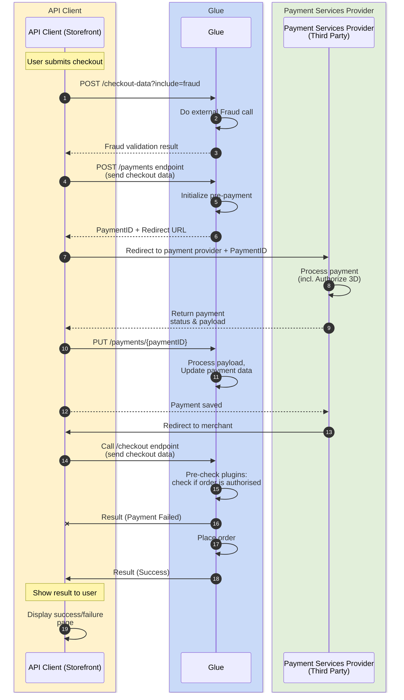
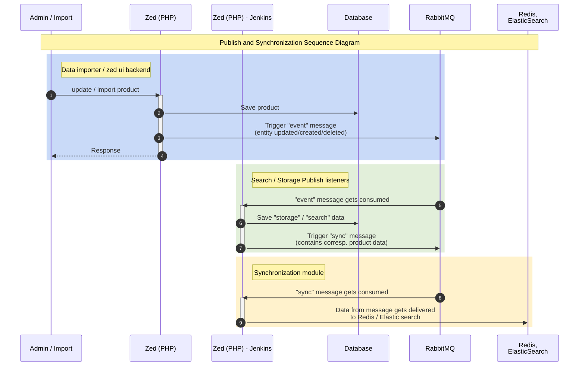

# Runtime View

Behavior and interactions of building blocks as runtime scenarios.

## Key Scenarios

### API Payment Flow

Shows the complete payment processing flow from checkout to order placement.

**Key Steps:**
1. Customer submits checkout with fraud validation
2. Payment is initialized, customer redirected to PSP
3. PSP processes payment including 3D Secure
4. Payment status returned and saved
5. Order is placed after authorization confirmation

### Publish and Synchronization

Shows how data changes propagate from database to Redis/ElasticSearch.

**Key Steps:**
1. Admin/import updates product data
2. Event message published to RabbitMQ
3. Listeners transform and stage data
4. Sync message triggers cache updates
5. Data delivered to Redis and ElasticSearch

---

*Corresponds to [arc42 Section 6](https://docs.arc42.org/section-6/)*
