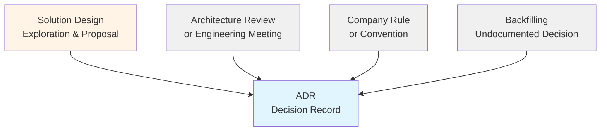

# Architecture Decision Records

This directory contains Architecture Decision Records (ADRs) that document significant architectural decisions made for the system.

## What is an ADR?

An Architecture Decision Record (ADR) captures a single architectural decision and its rationale. ADRs answer the question: **"Why did we choose this approach?"**

Each ADR documents:
- The context and problem
- The decision made
- The consequences (positive and negative)
- Alternatives that were considered

## When to Create an ADR

Create an ADR when:
- A significant architectural decision is made that impacts the system structure
- You choose between multiple technical approaches
- The decision affects multiple teams or components
- Future developers will need to understand why something was done a certain way
- Company rules or conventions require a specific approach to be documented

## Sources of ADRs

ADRs can originate from multiple sources:

**1. From Solution Designs (Most Common)**
- An SD explores multiple options
- Team reviews and makes decisions
- Key decisions are extracted into ADRs
- Example: SD-003 exploring CIAM options → ADR-005 "Use Auth0"

**2. From Meetings/Discussions**
- Decision made during architecture review
- Consensus reached in engineering meeting
- Document immediately as ADR

**3. From Company Rules/Conventions**
- Organization mandates specific approach
- Industry compliance requirement
- Document the constraint and rationale
- Example: "Use OAuth 2.0 per company security policy"

**4. Backfilling Past Decisions**
- Important decisions were made but never documented
- Document them now while context is still available
- Mark with historical date in context

## Naming Convention

ADRs follow the pattern: `adr-XXX-brief-title.md`

Examples:
- `adr-001-use-postgresql.md`
- `adr-005-use-auth0-as-ciam.md`
- `adr-012-multi-region-deployment.md`

## Template

Use `adr-000-template.md` as the starting point for new ADRs.

## ADR Lifecycle

ADRs have a status that reflects their lifecycle:

- **Proposed**: Under discussion, not yet decided
- **Accepted**: Decision approved and being implemented
- **Implemented**: Decision fully implemented in the system
- **Deprecated**: No longer valid but kept for historical reference
- **Superseded by ADR-XXX**: Replaced by a newer decision

## Best Practices

- **Write concisely**: ADRs should be readable in 5 minutes
- **Focus on "why"**: Explain reasoning, not just the what
- **Be honest about trade-offs**: Every decision has downsides
- **Date everything**: Use ISO dates (YYYY-MM-DD)
- **One decision per ADR**: Keep it focused
- **Reference related docs**: Link to SDs, external documentation, research

---

*Corresponds to [arc42 Section 9](https://docs.arc42.org/section-9/)*
